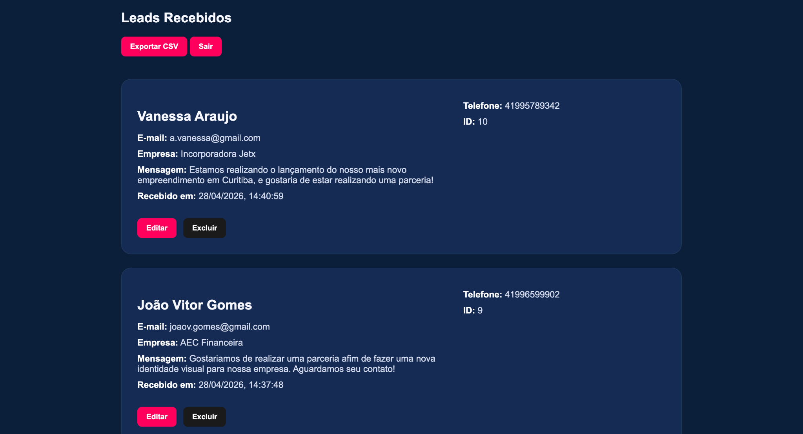

# 🚀 Téo Comunicação - Landing Page + CRM de Leads

Projeto desenvolvido para captação e gestão de leads para a empresa **Téo Comunicação**.

## 🌐 Acessos

- 🔗 Landing Page: https://teo-comunicacao-landing.vercel.app/
- 🔐 Painel Admin: https://teo-comunicacao-landing.vercel.app/admin.html
- ⚙️ API: https://teo-backend-az8f.onrender.com

---

## 📸 Preview do Projeto

### 🖥️ Landing Page


---

### 🔐 Painel Administrativo



---

## 📌 Sobre o projeto

A aplicação consiste em uma **landing page de alta conversão** integrada a um sistema de backend completo para gerenciamento de leads.

O sistema permite:

- Captura de leads via formulário
- Armazenamento em banco de dados
- Painel administrativo protegido
- Edição, exclusão e exportação de dados

---

## 🧩 Funcionalidades

### 📥 Landing Page
- Formulário de contato
- Validação de campos
- Bloqueio de múltiplos envios
- Integração com API

---

### 🔐 Autenticação
- Login com senha criptografada (bcrypt)
- Autenticação via JWT
- Proteção de rotas sensíveis

---

### 📊 Painel Administrativo
- Listagem de leads
- Paginação (15 por página)
- Edição inline de dados
- Exclusão de leads
- Exportação para CSV

---

## 🛠️ Tecnologias utilizadas

### Frontend
- HTML
- CSS
- JavaScript (Vanilla)

### Backend
- Node.js
- Express

### Banco de dados
- PostgreSQL (Render)

### Deploy
- Frontend: Vercel
- Backend: Render

---

## ⚙️ Estrutura do projeto

```bash
teo-comunicacao-landing/
│
├── frontend/
│ ├── index.html
│ ├── admin.html
│ ├── style.css
│ ├── admin.css
│ ├── script.js
│ └── admin.js
│
├── backend/
│ ├── server.js
│ ├── database.js
│ └── package.json
```

---

## 🔐 Variáveis de ambiente

```env
DATABASE_URL=
JWT_SECRET=
ADMIN_PASSWORD_HASH=
```

---

### 🚀 Como rodar localmente
Backend

```bash
cd backend
npm install
npm run dev
```

---

### 🌐 Frontend

```bash
open frontend/index.html
```

---

## 📈 Melhorias implementadas

- CRUD completo de leads
- Paginação otimizada
- Segurança com JWT
- Proteção contra envio duplicado
- Exportação de dados em CSV
- Interface administrativa funcional


---

## 💰 Aplicação real

Projeto desenvolvido com foco em uso real por cliente, podendo ser utilizado como:

- Landing page de marketing
- Sistema simples de CRM
- Base para aplicações maiores

---

## 👨‍💻 Autor

Desenvolvido por Hainer Soares  
🔗 https://github.com/HainerPS